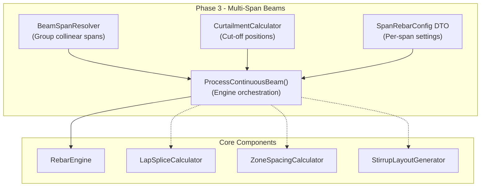

# Phase 3 Implementation Plan: Multi-Span Beams

Phase 3 introduces the capability to reinforce continuous beams spanning across multiple columns or walls as a single architectural unit.

## 🎯 Objectives
- **Automatic Span Discovery**: Group collinear/connected beams into a single continuous beam.
- **Continuous Reinforcement**: Top bars that bridge over internal supports (columns/walls).
- **Per-Span Customization**: Different bar counts and stirrup zones for each span.
- **Curtailment**: Automated calculation of bar cutoff points based on span length.

---

## 🏗️ Architecture

---

## 🛠️ Task List

### Task 3.1: Beam Span Resolver `[NEW]`
- **File**: `StructuralRebar/Core/Geometry/BeamSpanResolver.cs`
- **Logic**: 
  - Given a set of selected beams, group them by direction (Parallel check).
  - For each parallel group, find beams that share endpoints (within tolerance).
  - Sort spans from start to end.
  - Identify support positions (columns/walls at internal junctions).

### Task 3.2: Multi-Span DTOs `[NEW/MODIFY]`
- **File**: `StructuralRebar/DTO/SpanRebarConfig.cs`
- **Logic**:
  - `List<SpanRebarConfig>` in main `RebarRequest`.
  - Properties: `TopBarCount`, `BottomBarCount`, `StirrupSpacing`, `CurtailmentL1`, `CurtailmentL2`.

### Task 3.3: Curtailment Calculator `[NEW]`
- **File**: `StructuralRebar/Core/Calculators/CurtailmentCalculator.cs`
- **Logic**:
  - Standard cut-off rules (e.g., Top bars at L/3 or L/4).
  - Bottom bars extending 150mm into supports.
  - Development length checks.

### Task 3.4: Engine Orchestration `[MODIFY]`
- **File**: `StructuralRebar/Core/Engine/RebarEngine.cs`
- **Method**: `ProcessContinuousBeam(List<FamilyInstance> spans, RebarRequest request)`
- **Steps**:
  - Generate stirrups per span (reuse existing logic).
  - Generate continuous top bars (lapped or single length).
  - Generate per-span bottom bars with curtailment.

### Task 3.5: UI Enhancements `[MODIFY]`
- **File**: `StructuralRebar/UI/Panels/BeamRebarPanel.xaml`
- **Features**:
  - "Multi-Span" toggle.
  - DataGrid or ListView to show detected spans.
  - Ability to customize settings for the 'Global' beam or override per span.

---

## 🚀 Execution Strategy

1. **Step 1: Geometry** - Implement `BeamSpanResolver` and verify span detection logic.
2. **Step 2: Engine** - Implement basic `ProcessContinuousBeam` that just handles multiple stirrup zones.
3. **Step 3: Continuity** - Add top bar continuity across supports.
4. **Step 4: UI** - Finalize the multi-span UI controls.
