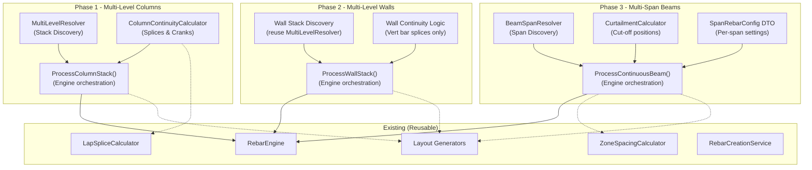

# Roadmap: Multi-Level & Multi-Span Rebar Generation

## Current State — What We Have

Your Rebar Suite currently reinforces **individual elements** in isolation:

| Component | Current Capability | Limitation |
|-----------|-------------------|------------|
| **Columns** | Ties + vertical bars + lap splicing + zone confinement | Single-level column only |
| **Walls** | Vertical + horizontal bars + lap splicing + corners + U-bars | Single-level wall only |
| **Beams** | Stirrups (zoned) + top/bottom/side bars + lap splicing | Single-span beam only |
| **Foundations** | Strip footing + footing pad reinforcement | ✅ Complete (no multi needed) |

---

## What "Multi-Level / Multi-Span" Means

### Multi-Level Columns & Walls
A real building has columns/walls stacked across multiple floors. The rebar must:
- **Continue through floor slabs** — starter bars from lower column project into the upper column
- **Handle changing cross-sections** — upper columns are often smaller than lower ones
- **Splice at correct locations** — lap splices typically just above floor level (≈ floor level + development length)
- **Adjust confinement zones** — code requires tighter ties near beam-column joints at each level

### Multi-Span Beams
A continuous beam spans across multiple columns. The rebar must:
- **Vary top/bottom bars per span** — more top bars at supports (hogging), more bottom at mid-span (sagging)
- **Handle curtailment** — bars terminate at calculated cut-off points within spans
- **Continuous top bars over supports** — reinforcement bridges across columns
- **Different stirrup zones per span** — each span has its own end-zone / mid-zone pattern

---

## Roadmap: 3 Phases

### Phase 1: Multi-Level Columns ✅ COMPLETE
**Complexity: Medium** | **Impact: High** | **Estimated effort: 3–5 sessions**

This is the natural starting point because columns are geometrically simpler (prismatic) and the existing `ProcessColumn` already handles lap splicing and zone confinement.

#### Key Tasks

**1.1 — Multi-Column Discovery Service** `[NEW]`
- New class `MultiLevelResolver` in `Core/Geometry/`
- Given one column, find all columns in the same stack (same grid intersection, different levels)
- Sort by base elevation (bottom → top)
- Detect cross-section changes between levels

**1.2 — Column Continuity Logic** `[NEW]`
- New class `ColumnContinuityCalculator` in `Core/Calculators/`
- Calculate starter bar length projecting into the column above (per code: typically ≥ lap length)
- Determine splice position (just above slab: floor level + 50mm + lap length)
- Handle **cranked bars** when upper column is narrower (offset + 1:6 crank)
- Apply code rules: ACI 318, NZS 3101, EC2, AS 3600

**1.3 — Update `RebarRequest`** `[MODIFY]`
- Add `bool MultiLevel` toggle
- Add `List<ElementId> StackedElementIds` (ordered bottom → top)

**1.4 — Update `RebarEngine.ProcessColumn`** `[MODIFY]`
- New method `ProcessColumnStack(List<FamilyInstance> stack, RebarRequest request)`
- Iterate each column in stack:
  - Generate ties for current column (existing logic)
  - Generate vertical bars with splice consideration to column above/below
  - Apply starter bar extensions and cranks
- Handle bottom column (foundation starter), middle columns (splice both ends), top column (standard termination)

**1.5 — Update `ColumnRebarPanel` UI** `[MODIFY]`
- Add "Multi-Level" checkbox toggle
- When enabled: auto-detect stacked columns from selection
- Optional: show detected stack in a visual list

---

### Phase 2: Multi-Level Walls ✅ COMPLETE
**Complexity: Medium–High** | **Impact: High** | **Estimated effort: 4–6 sessions**

Builds on Phase 1 patterns. Walls add the complication of varying lengths and connecting walls.

#### Key Tasks

**2.1 — Wall Stack Discovery** `[NEW]`
- Extend `MultiLevelResolver` to handle walls
- Find walls stacked vertically (same Location Curve XY footprint, different levels)
- Handle walls that change thickness between levels

**2.2 — Wall Continuity Logic** `[NEW]`
- Starter bar projection through floor slabs for vertical bars
- Horizontal bar termination at floor levels — no continuity needed
- Splice positions for vertical bars (just above each floor slab)
- Handle thickness changes: offset bars + crank to new face position

**2.3 — Update `RebarEngine.ProcessWall`** `[MODIFY]`
- New method `ProcessWallStack(List<Wall> stack, RebarRequest request)`
- Each wall in stack:
  - Horizontal bars: generate independently per level (existing logic)
  - Vertical bars: generate with splice continuity to the wall above
  - Corner/U-bar logic: independently per level
- Trim intersecting wall faces per level (existing `FindWallFaceTrimDistances`)

**2.4 — Update `WallRebarPanel` UI** `[MODIFY]`
- Add "Multi-Level" checkbox
- Stack detection from selection

---

### Phase 3: Multi-Span Beams ⬅ IN PROGRESS
**Complexity: High** | **Impact: Very High** | **Estimated effort: 6–10 sessions**

This is the most complex phase because each span may have different reinforcement requirements.

#### Key Tasks

**3.1 — Span Discovery and Beam Grouping** `[NEW]`
- New class `BeamSpanResolver` in `Core/Geometry/`
- Given a set of selected beams along the same gridline, identify them as spans of one continuous beam
- Determine support positions (column/wall intersections) 
- Sort spans in order along the continuous beam

**3.2 — Per-Span Rebar Configuration DTO** `[NEW]`
- New class `SpanRebarConfig` in `DTO/`
- Per-span: top bar count, bottom bar count, bar types, curtailment lengths
- Support for different bars at left/right support vs mid-span

**3.3 — Multi-Span Engine Logic** `[NEW]`
- New method `ProcessContinuousBeam(List<FamilyInstance> spans, RebarRequest request)`
- **Stirrups**: Generate per span (existing logic per span, each with its own zones)
- **Bottom bars**: 
  - Per-span bottom bars, typically cut off short of supports
  - Some bottom bars may be continuous through supports (code requirement)
- **Top bars**:
  - Continuous top bars over internal supports (hogging moment zone)
  - Curtailed at calculated points within spans
  - Top bars at external supports: standard hook or development length
- **Lap splices**: At pre-calculated positions within spans where moment is low

**3.4 — Curtailment Calculator** `[NEW]`
- New class `CurtailmentCalculator` in `Core/Calculators/`
- Basic curtailment rules: extend bars past the theoretical cut-off by at least `d` or `12φ`
- Percentage-based curtailment (e.g., 100% at support, 50% curtailed at L/4)
- Code-specific anchorage requirements at supports

**3.5 — Multi-Span UI** `[MODIFY]`
- Major UI enhancement to `BeamRebarPanel`
- **Span list view**: show detected spans with a visual diagram
- **Per-span configuration**: allow different top/bottom bar settings per span
- **Template / Copy**: copy settings from one span to all others
- **Curtailment controls**: position and percentage inputs

---

## Architecture Diagram



---

## Recommended Order & Dependencies

```
Phase 1: Multi-Level Columns     ✅ COMPLETE
    ↓ (shares MultiLevelResolver, continuity patterns)
Phase 2: Multi-Level Walls       ✅ COMPLETE
    ↓ (independent, can be parallel)
Phase 3: Multi-Span Beams        ⬅ IN PROGRESS (3.1-3.4 done, 3.5 testing)
```

---

## Reusable Components from Existing Code

| Existing Component | Reuse in Multi-Level/Span |
|---|---|
| `LapSpliceCalculator` | Splice length calculations for continuity bars |
| `ZoneSpacingCalculator` | Per-span end-zone stirrup densification |
| `ColumnLayoutGenerator` | Generate ties & verticals per level |
| `WallLayoutGenerator` | Generate H/V bars per level |
| `StirrupLayoutGenerator` | Generate stirrups per span |
| `ParallelLayoutGenerator` | Generate longitudinal bars per span |
| `RebarCreationService` | Place all rebar (unchanged) |

---

## Ready to Start?

I recommend starting with **Phase 1: Multi-Level Columns** first session. When you're ready, I'll create a detailed implementation plan for Phase 1 with specific file changes and code structure.
